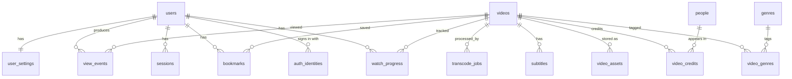
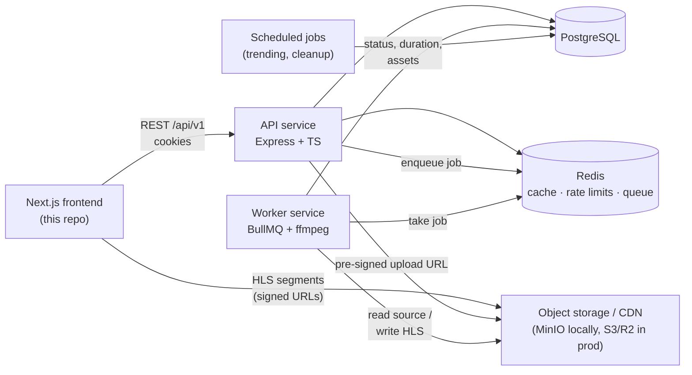
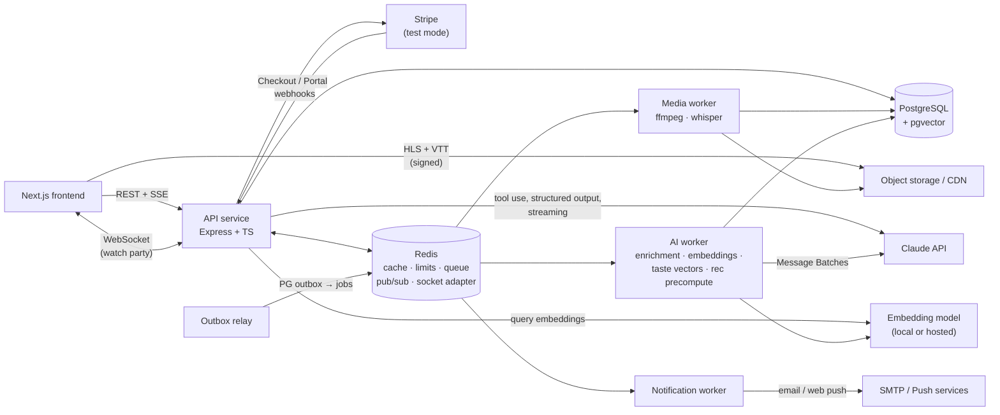

# Couch Time Backend: Product Requirements Document

| Field | Value |
|---|---|
| Product | Couch Time, a video streaming web app |
| Document | Backend PRD |
| Version | 1.1 (adds profiles, series, notifications, watch parties, payments and AI features) |
| Date | 4 October 2026 |
| Owner | Raymond Joseph |
| Status | Draft, ready to build |
| Related | [Architecture Decision Records](./adr/) |

---

## 1. Summary

Couch Time is a streaming app. The frontend (Next.js, in this repo) is mostly built, but almost everything it shows is **mock data or browser-only state**:

- Bookmarks and watch history live in `localStorage`, so they disappear on another device.
- Search returns hardcoded results.
- Categories are a fixed list in `NavBar.tsx`.
- Sign-in screens exist (email, Google, MetaMask, Starknet, Phantom), but none of them creates a real account.
- The video details page invents its director, cast, rating, language and subtitles.
- The prototype `server.js` keeps everything in memory and serves a single video.

This PRD defines a **production-style backend** that replaces all of that. It covers accounts and sessions, a real video catalogue in a database, video upload and transcoding into streamable HLS, per-user watch progress, bookmarks and history, search, trending, recommendations, an admin area, and the operational basics (tests, logging, CI, deployment).

It is also a **learning plan**, sized to take about **18 working weeks** part-time (about 4.5 months including a holiday break). Each week teaches a core backend skill. It runs in four phases:

| Phase | Weeks | Theme |
|---|---|---|
| **1. Core platform** | 1–9 | API, database, auth, personal data, media pipeline, discovery, deployment |
| **2. Product depth** | 10–14 | Profiles and parental controls, ratings and lists, series and episodes, notifications, watch parties, subscriptions |
| **3. AI** | 15–18 | Embeddings and semantic search, AI recommendations with experiments, the "Couch Concierge" assistant, the AI enrichment pipeline |
| **4. Polish** | after 18 | P2 items, performance, your own ideas |

Phase 1 alone is a complete, deployable product. If time runs short, stop at the end of any phase and still have something finished.

---

## 2. Goals and non-goals

### 2.1 Product goals

| # | Goal | How we know |
|---|---|---|
| G1 | A user can create an account and stay signed in across visits and devices. | Sign up, close the browser, come back next day: still signed in. |
| G2 | Everything personal (bookmarks, history, progress) follows the user to any device. | Bookmark on laptop, see it on phone. |
| G3 | Any uploaded video becomes streamable in several qualities without manual steps. | Upload a `.mp4`; within minutes it plays at 360p/720p/1080p with adaptive switching. |
| G4 | Users can find videos by search, category, trending and recommendations. | Every dashboard section is backed by a real query, none by mock data. |
| G5 | An admin can manage the catalogue without touching the database. | Create, edit, publish and unpublish videos through the API. |
| G6 | A household shares one account, but each person gets their own experience, and kids are safe. | Two profiles have different home rows; a kids profile never sees an R-rated title anywhere. |
| G7 | Discovery understands taste and intent, not just keywords and genres. | "Something cozy and short for a rainy night" returns fitting titles; "For You" rows differ per profile and beat the rule-based baseline in an offline evaluation. |
| G8 | Watching can be social. | Two friends watch in sync from different places, within 0.5 s. |
| G9 | The service can earn money safely. | A test-mode subscription unlocks features via webhooks; a failed payment downgrades after a grace period. |
| G10 | New uploads get rich metadata and subtitles without manual typing. | Upload → auto subtitles in 3 languages, plus suggested tags and a summary for admin review. |

### 2.2 Learning goals

By the end, you should be able to explain and build each of these on your own:

1. A layered HTTP API in TypeScript (routing, controllers, services, data access).
2. Relational data modelling, SQL, indexes, migrations and transactions.
3. Authentication: password hashing, JWTs, refresh-token rotation, cookies, CSRF, OAuth-style token exchange, wallet signatures.
4. Authorization with roles and ownership checks.
5. Background jobs and queues; long-running work outside the request.
6. Object storage, signed URLs and media delivery (HLS).
7. Caching, rate limiting and the trade-offs of each.
8. Automated testing at three levels (unit, integration, end-to-end).
9. Observability: structured logs, health checks, metrics.
10. Containers, CI pipelines and deploying a multi-service app.
11. Zero-downtime schema migrations with real data backfills (profiles, series).
12. Real-time systems: WebSockets, SSE, pub/sub across instances, distributed state sync.
13. Reliable messaging: the transactional outbox, idempotent consumers, webhooks (Stripe).
14. Applied AI engineering: embeddings and vector search, hybrid retrieval, recommender systems, LLM tool use, structured outputs, streaming, prompt caching, cost control, prompt-injection defence and evaluation.
15. Experimentation: feature flags, A/B tests and analytics SQL.

### 2.3 Non-goals (explicitly out of scope)

- Real money. Payments run in **Stripe test mode** only.
- DRM (Widevine/FairPlay). Signed URLs are enough.
- Live streaming (live TV, live events).
- Native mobile apps (the API should allow them later).
- Microservices. The system is one API service plus worker processes; see [ADR 0003](./adr/0003-express-layered-architecture.md).
- Training our own large ML models. AI features use embedding models, simple learned weights and a hosted LLM. Recommendations are built in two stages ([ADR 0016](./adr/0016-trending-and-recommendations.md) rules first, then [ADR 0027](./adr/0027-ai-recommendations-hybrid.md)).
- Letting an LLM make unreviewed decisions that can hurt users (maturity ratings, content warnings, payments, deletions).

---

## 3. Users and roles

| Role | Who | Can do |
|---|---|---|
| **Guest** | Not signed in. | Browse the catalogue, search, watch trailers. Cannot save anything. |
| **Viewer** | Signed-in user (the default role). | Everything a guest can, plus play full videos, save progress, bookmark, see history, change settings. |
| **Admin** | You, and anyone you promote. | Everything a viewer can, plus upload and manage videos, genres and people, and see job status and basic stats. |

See [ADR 0010](./adr/0010-authorization-roles.md).

**From week 10, an account has profiles** ([ADR 0021](./adr/0021-profiles-and-parental-controls.md)). The *account* (user) owns sign-in, billing and sessions. Each *profile* (up to 5; one can be a **kids** profile with a maturity limit) owns its progress, bookmarks, ratings, lists, notifications, AI conversations and recommendations.

**From week 14, what a viewer can do also depends on their plan** (Free, Standard, Premium), checked through one entitlements function ([ADR 0025](./adr/0025-payments-stripe.md)).

---

## 4. Where we are today

| Area | Current state (frontend + `server.js`) | Target |
|---|---|---|
| Sign-up / sign-in | Forms only; Google button commented out; wallet buttons do nothing. | Email + password, Google, MetaMask (and later Phantom/Starknet), with real sessions. |
| Session | `token` cookie read without verifying its signature. | Signed, short-lived access token plus rotating refresh token, both httpOnly cookies. |
| Catalogue | One hardcoded object in `server.js`. | `videos` table with genres, people, assets, publish status. |
| Video files | One folder of `.ts` segments served statically. | Uploads in object storage, transcoded to multi-bitrate HLS by a worker. |
| Thumbnails | Frontend uses a placeholder image everywhere. | Poster and backdrop images generated and stored per video. |
| Watch progress | In-memory map, lost on restart. | `watch_progress` table, throttled writes. |
| Bookmarks | `localStorage` (`bookmarked_videos`). | `bookmarks` table, plus a one-time import from `localStorage`. |
| Watched history | `localStorage` (`watched_videos`). | `watch_history` derived from progress and view events. |
| Categories | Hardcoded tabs: All, Comedy, Fantasy, Drama, History, Horror. | `genres` table and `GET /genres`. |
| Search | `SearchBar.tsx` mock results. | PostgreSQL full-text search with typo tolerance. |
| Trending | Sorted by an in-memory open counter. | Time-decayed score over view events, recomputed on a schedule. |
| "You Might Also Like" | Six placeholder images. | Genre and co-watch based recommendations. |
| Video details | Director, cast, rating, language, subtitles all invented. | Real fields from `people`, `video_credits`, `subtitles`, `videos`. |
| Settings / Account | Sidebar links to `/dashboard/setting` and `/dashboard/account`; no pages yet. | Profile, preferences, sessions list, delete account. |
| Who's watching | One identity per account. | Profiles, kids profile, PIN ([ADR 0021](./adr/0021-profiles-and-parental-controls.md)). |
| TV series | Movies only. | Series → seasons → episodes, next episode, skip intro ([ADR 0022](./adr/0022-series-and-episodes-model.md)). |
| Ratings and lists | Only a bookmark toggle. | Thumbs up/down, "not interested", custom shareable lists. |
| Notifications | None. | In-app (live), email digest, web push ([ADR 0024](./adr/0024-notifications-outbox.md)). |
| Watching together | None. | Synced watch parties with chat ([ADR 0023](./adr/0023-realtime-websockets-watch-party.md)). |
| Plans | Everything free. | Free / Standard / Premium via Stripe test mode ([ADR 0025](./adr/0025-payments-stripe.md)). |
| AI | None. | Semantic search, AI recommendations with reasons, Couch Concierge assistant, auto subtitles and metadata ([ADR 0026](./adr/0026-embeddings-and-pgvector.md) to [ADR 0030](./adr/0030-ai-media-enrichment-pipeline.md)). |

---

## 5. Functional requirements

Each requirement has an ID, a priority (**P0** = must have for v1, **P1** = should have, **P2** = nice to have), the frontend screen that uses it, and acceptance criteria. Endpoint details are in [section 7](#7-api-contract).

### 5.1 Accounts and authentication

| ID | Requirement | Priority | Frontend |
|---|---|---|---|
| AUTH-1 | Sign up with email and password. | P0 | `SignUpForm.tsx` |
| AUTH-2 | Sign in with email and password. | P0 | `SignInForm.tsx` |
| AUTH-3 | Stay signed in: access token expires in 15 minutes, refreshed silently with a refresh token that lasts 30 days. | P0 | `src/api/index.ts` interceptor |
| AUTH-4 | Sign out of this device; sign out of all devices. | P0 | Sidebar `LogOut` |
| AUTH-5 | Sign in with Google (Firebase ID token exchanged for our session). | P1 | `SocialLoginButtons.tsx` |
| AUTH-6 | Sign in with MetaMask (Ethereum signature, SIWE). | P1 | `SocialLoginButtons.tsx` |
| AUTH-7 | Sign in with Phantom (Solana) and Starknet. | P2 | `SocialLoginButtons.tsx` |
| AUTH-8 | Verify email address. | P1 | New screen |
| AUTH-9 | Forgot / reset password. | P1 | New screen |
| AUTH-10 | Link several sign-in methods to one account. | P2 | Account page |
| AUTH-11 | See and revoke active sessions (device, last used). | P1 | Account page |

**Acceptance criteria:**
- Passwords are stored only as Argon2id hashes; see [ADR 0008](./adr/0008-authentication-jwt-cookies.md).
- Sign-in with a wrong password returns the same error as an unknown email, so attackers can't tell which emails exist.
- Five failed sign-ins for one email within 15 minutes trigger a 15-minute lockout (rate limit).
- Reusing an already-used refresh token revokes the whole session family; this is replay detection.
- No token is ever readable by JavaScript: cookies are `httpOnly`, `Secure` in production and `SameSite=Lax`.

### 5.2 Users and settings

| ID | Requirement | Priority | Frontend |
|---|---|---|---|
| USER-1 | Get my profile (`GET /me`). | P0 | Greeting "Continue for Ekene Smart" in `ContinueWatching.tsx` |
| USER-2 | Update display name and avatar. | P1 | `/dashboard/account` |
| USER-3 | Preferences: autoplay previews, default quality, subtitle language, preview muted. | P1 | `/dashboard/setting` |
| USER-4 | Delete my account and all personal data. | P1 | `/dashboard/account` |
| USER-5 | Export my data as JSON. | P2 | `/dashboard/account` |

### 5.3 Catalogue

| ID | Requirement | Priority | Frontend |
|---|---|---|---|
| CAT-1 | List published videos with cursor pagination and filters (genre, year, sort). | P0 | Dashboard grid, category tabs |
| CAT-2 | Get one video with full details: genres, credits, rating, language, subtitles, images, duration. | P0 | `video/[id]/page.tsx` |
| CAT-3 | List genres. | P0 | `NavBar.tsx` tabs, `CategoryDialog.tsx` |
| CAT-4 | Spotlight: videos marked featured, with a schedule window. | P0 | `SportLight.tsx` |
| CAT-5 | Trailer clip info (`src`, `start`, `end`). | P0 | `VideoPreviewer.tsx` |
| CAT-6 | People (cast and crew) and their filmography. | P2 | New page |
| CAT-7 | Slugs for readable URLs (`/video/in-the-grey`). | P2 | Routing |

**Acceptance criteria:**
- Drafts and unpublished videos never appear to non-admins, including in search, trending and recommendations.
- Every video response includes the per-user fields `progress`, `action` and `startAt` (null, `"play"` and `0` for guests). This keeps the contract the frontend already uses.

### 5.4 Playback

| ID | Requirement | Priority | Frontend |
|---|---|---|---|
| PLAY-1 | Return a playback URL: a signed HLS master playlist that expires after a few hours. | P0 | `VideoPlayer`, details page |
| PLAY-2 | Adaptive bitrate: 360p, 720p and 1080p renditions in one master playlist. | P0 | `hls.js` picks quality automatically |
| PLAY-3 | Subtitles as WebVTT tracks listed in the master playlist. | P1 | Details page "Subtitles" |
| PLAY-4 | Guests can play trailers only; full playback needs a signed-in viewer. | P0 | Previewer vs details page |
| PLAY-5 | Thumbnails strip (sprite + VTT) for scrubbing previews. | P2 | Progress bar hover |

### 5.5 Watch progress and history

| ID | Requirement | Priority | Frontend |
|---|---|---|---|
| PROG-1 | Save position: `PUT /me/progress/:videoId` with `{ position }`. The client sends it about every 10 seconds and on pause. | P0 | Details page `saveProgress` |
| PROG-2 | Continue watching: started, under 95% watched, most recent first. | P0 | `ContinueWatching.tsx` |
| PROG-3 | Mark as finished at 95% or more; it leaves Continue Watching and is added to history. | P0 | — |
| PROG-4 | Watch history list, paginated, with "remove from history". | P0 | `/dashboard/watched` |
| PROG-5 | View events (`play`, `pause`, `complete`) recorded for analytics and trending. | P1 | Player |

**Acceptance criteria:**
- Out-of-order saves don't move progress backwards. Each save carries a client timestamp, and an older timestamp is ignored.
- A flood of saves (for example a buggy client sending 10 per second) is rate-limited and doesn't hit the database every time; see [ADR 0015](./adr/0015-watch-progress-and-events.md).

### 5.6 Bookmarks

| ID | Requirement | Priority | Frontend |
|---|---|---|---|
| BM-1 | Add a bookmark; adding twice does nothing (idempotent). | P0 | `VideoCard.tsx` bookmark button |
| BM-2 | Remove a bookmark. | P0 | Same |
| BM-3 | List my bookmarks, newest first, paginated. | P0 | `/dashboard/bookmarks` |
| BM-4 | One-time import of `localStorage` bookmarks and history after first sign-in. | P1 | `VideoContext.tsx` |

### 5.7 Discovery

| ID | Requirement | Priority | Frontend |
|---|---|---|---|
| DISC-1 | Search titles, descriptions and cast with typo tolerance ("intersteler" finds "Interstellar"). | P0 | `SearchBar.tsx` (Cmd+K) |
| DISC-2 | Autocomplete suggestions while typing, under 100 ms server time. | P1 | Same |
| DISC-3 | Trending: time-decayed popularity over the last 7 days. | P0 | `Trending.tsx` |
| DISC-4 | "You Might Also Like" for a video: same genres first, then "people who watched this also watched". | P1 | Details page |
| DISC-5 | Personalised home rows ("Because you watched X"). | P2 | Dashboard |

### 5.8 Admin and media pipeline

| ID | Requirement | Priority |
|---|---|---|
| ADM-1 | Create, edit and delete videos, genres and people. | P0 |
| ADM-2 | Upload a source video straight to object storage with a pre-signed URL (the file never passes through the API). | P0 |
| ADM-3 | On upload complete, queue a transcode job: probe, transcode to 3 renditions, package as HLS, generate poster and thumbnails. | P0 |
| ADM-4 | See job status and progress (queued, running at 42%, failed with reason, done); retry failed jobs. | P0 |
| ADM-5 | Publish and unpublish; schedule a spotlight window. | P0 |
| ADM-6 | Upload subtitles (`.srt` converted to `.vtt`). | P1 |
| ADM-7 | Basic stats: views per day, top videos, active users. | P2 |

> **Sections 5.9–5.18 were added in v1.1** (Phases 2 and 3). From week 10 onwards, "my" data means **the active profile's** data.

### 5.9 Profiles and parental controls

[ADR 0021](./adr/0021-profiles-and-parental-controls.md)

| ID | Requirement | Priority | Frontend |
|---|---|---|---|
| PROF-1 | Create, rename, delete and choose an avatar for up to 5 profiles per account (limit by plan). | P0 | New "Who's watching?" screen after sign-in |
| PROF-2 | Select the active profile; all personal data is scoped to it. | P0 | Profile switcher in `NavBar` |
| PROF-3 | Kids profile with a maximum maturity rating; enforced in **every** listing, search, recommendation and assistant tool. | P0 | Kids badge |
| PROF-4 | Optional 4-digit PIN on adult profiles. | P1 | PIN pad |
| PROF-5 | Per-profile language and subtitle defaults. | P1 | Settings |
| PROF-6 | Onboarding "pick 3 titles you like" for new profiles (seeds AI taste). | P1 | New screen |

### 5.10 Ratings, reviews and lists

| ID | Requirement | Priority | Frontend |
|---|---|---|---|
| RATE-1 | Thumbs up / thumbs down / "love it" on a title. | P0 | `VideoCard`, details page |
| RATE-2 | "Not interested", hidden from recommendations. | P0 | Card menu |
| RATE-3 | Custom lists ("Halloween marathon"): create, reorder, add/remove. | P1 | New lists page |
| RATE-4 | Share a list by public link (read-only, unguessable slug). | P2 | Share button |
| RATE-5 | Short text reviews with moderation (an AI toxicity check queues flagged reviews for admin). | P2 | Details page |
| RATE-6 | Aggregated rating ("92% liked") per title, cached. | P1 | Details page |

### 5.11 Series and episodes

[ADR 0022](./adr/0022-series-and-episodes-model.md)

| ID | Requirement | Priority | Frontend |
|---|---|---|---|
| SER-1 | Titles are movies or series; series have seasons and episodes. | P0 | Details page season picker |
| SER-2 | Continue Watching shows the series with the **next unfinished episode**. | P0 | `ContinueWatching.tsx` |
| SER-3 | "Next episode" countdown at the credits; autoplay setting. | P0 | Player |
| SER-4 | Skip intro / skip recap buttons from markers. | P1 | Player |
| SER-5 | "New episode" badge and notification (see 5.12). | P1 | Card badge |

### 5.12 Notifications

[ADR 0024](./adr/0024-notifications-outbox.md)

| ID | Requirement | Priority | Frontend |
|---|---|---|---|
| NOTIF-1 | In-app notification centre with unread count, live updates (SSE). | P0 | Bell icon in `NavBar` |
| NOTIF-2 | Triggers: new episode of a followed series, list title leaving soon, watch-party invite, payment problem, weekly "Picked for you". | P0 | — |
| NOTIF-3 | Per-type, per-channel preferences (in-app / email / push). | P1 | Settings |
| NOTIF-4 | Email digests with one-click unsubscribe. | P1 | Email |
| NOTIF-5 | Web push (opt-in), with quiet hours. | P2 | Service worker |

### 5.13 Watch party

[ADR 0023](./adr/0023-realtime-websockets-watch-party.md)

| ID | Requirement | Priority | Frontend |
|---|---|---|---|
| PARTY-1 | Host creates a party for a video and gets an invite link (24 h). | P0 | "Watch together" button |
| PARTY-2 | Play / pause / seek sync across members within 0.5 s; late joiners land on the right spot. | P0 | Player |
| PARTY-3 | Live chat and emoji reactions, rate-limited. | P1 | Side panel |
| PARTY-4 | Host controls: transfer host, kick, lock the room. | P1 | Panel |
| PARTY-5 | Plan and maturity rules apply to every member. | P0 | — |

### 5.14 Subscriptions and payments

[ADR 0025](./adr/0025-payments-stripe.md)

| ID | Requirement | Priority | Frontend |
|---|---|---|---|
| PAY-1 | Plans: Free / Standard / Premium (test mode), with entitlements (profiles, quality, concurrent streams, watch party, AI quota). | P0 | Pricing page |
| PAY-2 | Subscribe via Stripe Checkout; manage via Customer Portal. | P0 | Account page |
| PAY-3 | Webhook-driven subscription state, idempotent, order-independent. | P0 | — |
| PAY-4 | Failed payment → notification, 3-day grace, then downgrade. | P0 | Banner |
| PAY-5 | Concurrent stream limit via playback heartbeats. | P1 | "Too many screens" message |
| PAY-6 | Downgrade handling: extra profiles become read-only, never deleted. | P1 | Profile screen |

### 5.15 AI recommendations

[ADR 0026](./adr/0026-embeddings-and-pgvector.md), [ADR 0027](./adr/0027-ai-recommendations-hybrid.md)

| ID | Requirement | Priority | Frontend |
|---|---|---|---|
| AIREC-1 | Personal "For You" row per profile from a hybrid recommender (taste embedding + co-watch + trending + freshness), with diversity. | P0 | Dashboard row |
| AIREC-2 | "Because you watched X" rows from the last titles watched. | P0 | Dashboard rows |
| AIREC-3 | A short, honest **reason** under each pick, generated from real signals ("Because you liked *Heat* and tense heists"). | P1 | Card subtitle |
| AIREC-4 | "More like this" on the details page uses embeddings + co-watch (replaces DISC-4's rules as the default once it wins the A/B test). | P0 | "You Might Also Like" |
| AIREC-5 | Cold start: onboarding picks + trending by genre. | P0 | Onboarding |
| AIREC-6 | Feedback loop: thumbs, "not interested", abandons under 5 minutes all adjust the taste vector. | P0 | — |
| AIREC-7 | Weekly "Picked for you" email using the same engine. | P2 | Email |
| AIREC-8 | Offline evaluation (Recall@10, NDCG@10, coverage) in CI and an online A/B test vs the rule-based baseline. | P0 | Admin stats |

**Acceptance criteria:**
- Every recommendation obeys the same filters as browsing (published, maturity, not completed, plan).
- The LLM **never selects** items; it only words the reason. A reason may only cite titles the profile actually watched or rated.
- Served from cache under 150 ms p95.

### 5.16 AI search and assistant

[ADR 0028](./adr/0028-hybrid-semantic-search.md), [ADR 0029](./adr/0029-llm-integration-claude.md)

| ID | Requirement | Priority | Frontend |
|---|---|---|---|
| AIS-1 | Semantic search: "a heist movie with a twist ending" finds fitting titles without keyword matches. | P0 | `SearchBar` |
| AIS-2 | Hybrid ranking (keyword + vector, merged by Reciprocal Rank Fusion). | P0 | — |
| AIS-3 | Natural-language filters parsed by the LLM ("under 2 hours", "from the 90s", "for kids") and shown as removable chips. | P1 | Filter chips |
| AIS-4 | **Couch Concierge**: a chat assistant that recommends from the real catalogue using tools (search, recommendations, details, history, add-to-list, start party), streaming answers with real title cards. | P0 | New chat panel (Cmd+J) |
| AIS-5 | Assistant memory within a conversation; conversations listable and deletable; 30-day retention. | P1 | Chat history |
| AIS-6 | Usage limits by plan; per-profile monthly token budget; spend dashboard. | P0 | "X messages left today" |
| AIS-7 | Kids mode: assistant off by default; when on, stricter prompt + filters. | P0 | — |
| AIS-8 | "Find the scene where…" over transcript embeddings. | P2 | Search tab |

**Acceptance criteria:**
- The assistant can only show titles that came from tool results; anything else is dropped before display.
- Catalogue or user text that tries to inject instructions does not change behaviour (eval cases).
- First streamed token under 2 s; search works with the LLM switched off.

### 5.17 AI media enrichment

[ADR 0030](./adr/0030-ai-media-enrichment-pipeline.md)

| ID | Requirement | Priority |
|---|---|---|
| ENR-1 | Auto-generated subtitles (speech-to-text) in the source language as WebVTT. | P0 |
| ENR-2 | Subtitle translation into configured languages, preserving cue timings. | P1 |
| ENR-3 | Suggested tags, moods, themes, spoiler-free summary, short synopsis. | P0 |
| ENR-4 | Suggested content warnings and maturity rating (**always human-confirmed**). | P0 |
| ENR-5 | Suggested intro/credits markers and chapters. | P1 |
| ENR-6 | Admin review queue: accept, edit or reject per field; acceptance-rate metrics per prompt version. | P0 |
| ENR-7 | Cost estimate per title, monthly budget cap, per-title toggle. | P0 |

### 5.18 Experiments, analytics and audit

[ADR 0031](./adr/0031-experiments-and-feature-flags.md)

| ID | Requirement | Priority |
|---|---|---|
| EXP-1 | Feature flags with % rollout and targeting; **every AI feature has a kill switch**. | P0 |
| EXP-2 | A/B experiments with deterministic bucketing, exposure logging and a results view. | P0 |
| EXP-3 | Admin analytics: daily active profiles, completion rates, top titles, recommendation performance, AI cost per feature. | P1 |
| EXP-4 | Audit log of admin actions (publish, rating changes, role changes, flag changes, accepted AI suggestions). | P0 |

---

## 6. Data model

PostgreSQL, managed with Prisma migrations ([ADR 0004](./adr/0004-postgresql-database.md), [ADR 0005](./adr/0005-prisma-orm-and-migrations.md)). IDs are UUIDv7, which sort by time and are safe to show in URLs.

### 6.1 Entities



### 6.2 Tables

**users**

| Column | Type | Notes |
|---|---|---|
| id | uuid PK | UUIDv7 |
| email | citext, unique, nullable | Nullable because wallet-only users have no email. |
| email_verified_at | timestamptz, nullable | |
| password_hash | text, nullable | Argon2id; null for social or wallet-only users. |
| display_name | text | |
| avatar_url | text, nullable | |
| role | enum `viewer` / `admin` | Default `viewer`. |
| created_at, updated_at | timestamptz | |
| deleted_at | timestamptz, nullable | Soft delete, then hard delete after 30 days (USER-4). |

**auth_identities**: one row per sign-in method linked to a user.

| Column | Type | Notes |
|---|---|---|
| id | uuid PK | |
| user_id | uuid FK → users | |
| provider | enum `password` / `google` / `ethereum` / `solana` / `starknet` | |
| provider_user_id | text | Firebase uid, or a lower-cased wallet address. |
| created_at | timestamptz | |
| | unique (provider, provider_user_id) | One account per wallet or Google user. |

**sessions**: one row per signed-in device; holds the refresh-token family.

| Column | Type | Notes |
|---|---|---|
| id | uuid PK | Also called the "family id". |
| user_id | uuid FK | |
| refresh_token_hash | text | SHA-256 of the current refresh token; the raw token is never stored. |
| user_agent, ip | text | For the sessions list (AUTH-11). |
| last_used_at, expires_at, revoked_at | timestamptz | |

**wallet_nonces**: short-lived challenges for wallet sign-in. Each holds a nonce, an address, an expiry (5 minutes) and a used-at time. It could live in Redis instead; see [ADR 0009](./adr/0009-social-and-wallet-login.md).

**email_tokens**: for email verification and password reset. Each holds a token hash, a purpose, an expiry and a used-at time.

**user_settings**: `user_id` PK, `autoplay_previews` bool, `preview_muted` bool, `default_quality` enum, `subtitle_language` text.

**videos**

| Column | Type | Notes |
|---|---|---|
| id | uuid PK | |
| slug | text, unique | |
| title, description | text | |
| release_year | int | |
| release_date | date, nullable | |
| maturity_rating | enum `G` / `PG` / `PG-13` / `R` / `NC-17` | |
| language | text | ISO 639-1, e.g. `en`. |
| duration_seconds | int, nullable | Filled in by the transcoder. |
| trailer_start, trailer_end | int | Seconds into the video used for the preview clip. |
| status | enum `draft` / `processing` / `ready` / `failed` | Pipeline state. |
| published_at | timestamptz, nullable | Null means not public. |
| featured_from, featured_until | timestamptz, nullable | Spotlight window (CAT-4). |
| trending_score | double | Updated by a scheduled job ([ADR 0016](./adr/0016-trending-and-recommendations.md)). |
| search_vector | tsvector | Generated column, GIN index ([ADR 0017](./adr/0017-search-postgres-full-text.md)). |
| created_at, updated_at | timestamptz | |

**genres**: `id`, `slug` (unique), `name`. **video_genres**: (`video_id`, `genre_id`) composite primary key.

**people**: `id`, `name`, `bio`, `photo_url`. **video_credits**: `video_id`, `person_id`, `role` enum (`director` / `actor` / `writer`), `character_name`, `billing_order`.

**video_assets**: everything stored for a video.

| Column | Type | Notes |
|---|---|---|
| id | uuid PK | |
| video_id | uuid FK | |
| kind | enum `source` / `hls_master` / `hls_rendition` / `poster` / `backdrop` / `thumbnail_sprite` | |
| storage_key | text | Object key in the bucket, e.g. `videos/{id}/hls/720p/index.m3u8`. |
| width, height, bitrate | int, nullable | For renditions. |
| size_bytes | bigint | |

**subtitles**: `id`, `video_id`, `language`, `label`, `storage_key`.

**transcode_jobs**: `id`, `video_id`, `status` (`queued` / `running` / `succeeded` / `failed`), `progress` 0–100, `attempts`, `error`, `started_at`, `finished_at`. This mirrors the queue's state so the admin UI can show it even after the queue has cleaned up.

**watch_progress**

| Column | Type | Notes |
|---|---|---|
| user_id, video_id | composite PK | One row per user and video. |
| position_seconds | int | |
| duration_seconds | int | Copied in so percent can be computed without a join. |
| completed_at | timestamptz, nullable | Set at 95% or more. |
| client_updated_at | timestamptz | Rejects out-of-order writes (PROG acceptance criteria). |
| updated_at | timestamptz | Index `(user_id, updated_at desc)` for Continue Watching. |

**bookmarks**: (`user_id`, `video_id`) composite primary key, plus `created_at`; index `(user_id, created_at desc)`.

**view_events**: append-only, high volume. Each row has `id` bigserial, `video_id`, `user_id` (nullable for guests), `session_key`, `type` (`trailer_play` / `play` / `complete`) and `created_at`. It is partitioned by month (a stretch goal in week 8).

**trending_snapshots** (optional): stores the computed top-N per day, for history and debugging.

### 6.3 Key indexes (and why)

| Index | Serves |
|---|---|
| `videos (published_at) WHERE published_at IS NOT NULL` | Public catalogue listing (a partial index). |
| `videos (trending_score desc) WHERE published_at IS NOT NULL` | Trending row. |
| `videos USING GIN (search_vector)` | Full-text search. |
| `videos USING GIN (title gin_trgm_ops)` | Typo-tolerant autocomplete. |
| `watch_progress (user_id, updated_at desc) WHERE completed_at IS NULL` | Continue Watching. |
| `bookmarks (user_id, created_at desc)` | Bookmarks page. |
| `view_events (video_id, created_at)` | Trending aggregation. |

**Learning task:** for each index, run `EXPLAIN ANALYZE` on its query with and without the index, on a table seeded with 100k rows.

### 6.4 Additions in v1.1 (Phases 2 and 3)

**Ownership change (week 10):** `watch_progress`, `bookmarks` and `view_events` move from `user_id` to **`profile_id`** through an expand/contract migration ([ADR 0021](./adr/0021-profiles-and-parental-controls.md)). The same goes for every new personal table below.

**Catalogue split (week 11):** browse-level fields move from `videos` to a new **`titles`** table; `videos` becomes the playable unit (movie file or episode) ([ADR 0022](./adr/0022-series-and-episodes-model.md)). Genres, credits, images, search vectors and embeddings attach to `titles`.

| Table | Key columns | ADR |
|---|---|---|
| `profiles` | id, user_id, name, avatar_key, is_kids, max_maturity_rating, language, pin_hash | 0021 |
| `titles` | id, kind (`movie`/`series`), slug, title, description, release_year, maturity_rating, trending_score, search_vector | 0022 |
| `seasons` | id, title_id, number, name | 0022 |
| `videos` (changed) | + title_id, season_id, episode_number, markers jsonb | 0022 |
| `ratings` | (profile_id, title_id) PK, value (-1 / 1 / 2), created_at | 0027 |
| `not_interested` | (profile_id, title_id) PK | 0027 |
| `lists`, `list_items` | id, profile_id, name, slug, is_public · (list_id, title_id, position) | — |
| `reviews` | id, profile_id, title_id, body, status (`visible`/`flagged`/`hidden`) | — |
| `outbox_events` | id, type, payload jsonb, created_at, processed_at | 0024 |
| `notifications` | id, profile_id, type, title, body, link, read_at, created_at | 0024 |
| `notification_prefs` | (profile_id, type) PK, in_app, email, push | 0024 |
| `push_subscriptions` | id, profile_id, endpoint, keys jsonb, created_at | 0024 |
| `watch_parties`, `party_members`, `party_messages` | id, host_profile_id, video_id, invite_code, status · (party_id, profile_id, role) · id, party_id, profile_id, body | 0023 |
| `subscriptions` | user_id, stripe_customer_id, stripe_subscription_id, plan, status, current_period_end, cancel_at_period_end | 0025 |
| `stripe_events` | id PK (Stripe event id), type, received_at | 0025 |
| `title_embeddings` | title_id PK, model, dims, content_hash, embedding vector(1024) + HNSW index | 0026 |
| `chunk_embeddings` (P2) | id, video_id, start_s, end_s, text, embedding | 0026 |
| `taste_vectors` | profile_id PK, model, embedding, updated_at | 0027 |
| `rec_impressions` | id, rec_id, profile_id, title_id, row, position, variant, created_at, clicked_at, played_10m_at | 0027 |
| `ai_conversations`, `ai_messages` | id, profile_id, created_at · id, conversation_id, role, content jsonb (full content blocks), tokens | 0029 |
| `ai_usage` | id, profile_id, feature, model, effort, input_tokens, output_tokens, cache_read_tokens, cost_usd, latency_ms, stop_reason, created_at | 0029 |
| `ai_suggestions` | id, title_id, field, value jsonb, model, prompt_version, status, reviewed_by | 0030 |
| `feature_flags`, `experiments`, `exposures` | key, enabled, rollout_percent, rules · key, variants, status, primary_metric · (experiment_key, profile_id) | 0031 |
| `audit_log` | id, actor_user_id, action, entity, entity_id, before, after, ip, created_at | 0031 |

New extensions: `vector` (pgvector). New materialised views: `daily_active_profiles`, `title_daily_stats`, `rec_performance_daily`, `ai_cost_daily`.

---

## 7. API contract

Conventions follow [ADR 0011](./adr/0011-rest-api-conventions.md):

- **Base URL:** `/api/v1`.
- **Format:** JSON with `camelCase` fields; dates in ISO 8601 UTC.
- **Auth:** the `access_token` cookie, or `Authorization: Bearer` for non-browser clients.
- **Errors:** RFC 9457 problem details ([ADR 0007](./adr/0007-validation-and-error-format.md)).
- **Pagination:** a `?cursor=&limit=` query, returning `{ items, nextCursor }`.

Legend for the Auth column: **—** = public, **G** = guest allowed (with extra data if signed in), **U** = signed-in viewer, **A** = admin.

### 7.1 Auth

| Method | Path | Auth | Body / query | Response |
|---|---|---|---|---|
| POST | `/auth/signup` | — | `{ email, password, displayName }` | 201 `{ user }` + cookies |
| POST | `/auth/signin` | — | `{ email, password }` | 200 `{ user }` + cookies |
| POST | `/auth/refresh` | refresh cookie | — | 204 + new cookies |
| POST | `/auth/signout` | U | — | 204, clears cookies |
| POST | `/auth/signout-all` | U | — | 204, revokes every session |
| POST | `/auth/google` | — | `{ idToken }` (Firebase) | 200 `{ user }` + cookies |
| GET | `/auth/wallet/nonce` | — | `?address=&chain=` | 200 `{ message, nonce }` |
| POST | `/auth/wallet/verify` | — | `{ address, chain, message, signature }` | 200 `{ user }` + cookies |
| POST | `/auth/verify-email` | — | `{ token }` | 204 |
| POST | `/auth/forgot-password` | — | `{ email }` | 204, even for unknown emails |
| POST | `/auth/reset-password` | — | `{ token, password }` | 204, revokes all sessions |

### 7.2 Me

| Method | Path | Auth | Notes |
|---|---|---|---|
| GET | `/me` | U | Profile + role + settings |
| PATCH | `/me` | U | `{ displayName?, avatarUrl? }` |
| DELETE | `/me` | U | Soft delete; hard delete after 30 days |
| GET / PATCH | `/me/settings` | U | |
| GET | `/me/sessions` | U | Devices list |
| DELETE | `/me/sessions/:id` | U | Revoke one |
| GET | `/me/continue-watching` | U | Replaces `/videos/continue-watching` |
| PUT | `/me/progress/:videoId` | U | `{ position, clientTime }`; idempotent |
| GET | `/me/history` | U | Paginated |
| DELETE | `/me/history/:videoId` | U | |
| GET | `/me/bookmarks` | U | Paginated |
| PUT | `/me/bookmarks/:videoId` | U | Idempotent add, 204 |
| DELETE | `/me/bookmarks/:videoId` | U | 204 |
| POST | `/me/import` | U | `{ bookmarks: [], watched: [] }` from `localStorage` (BM-4) |
| GET | `/me/export` | U | P2 |

### 7.3 Catalogue and discovery

| Method | Path | Auth | Notes |
|---|---|---|---|
| GET | `/videos` | G | `?genre=&year=&sort=new\|popular\|title&cursor=&limit=` |
| GET | `/videos/:idOrSlug` | G | Full details + `progress`/`action`/`startAt` |
| GET | `/videos/:id/clip` | G | Trailer `{ src, start, end }`; records a `trailer_play` event |
| GET | `/videos/:id/playback` | U | `{ src }` signed master playlist URL + subtitles |
| GET | `/videos/:id/related` | G | "You Might Also Like" |
| GET | `/videos/trending` | G | `?limit=` |
| GET | `/videos/spotlight` | G | Featured now |
| POST | `/videos/:id/events` | G | `{ type }`, rate limited |
| GET | `/genres` | — | |
| GET | `/search` | G | `?q=&cursor=&limit=` |
| GET | `/search/suggest` | — | `?q=`; top 8 titles |
| GET | `/people/:id` | — | P2 |

### 7.4 Admin

| Method | Path | Notes |
|---|---|---|
| POST | `/admin/videos` | Create draft |
| PATCH / DELETE | `/admin/videos/:id` | |
| POST | `/admin/videos/:id/upload-url` | Pre-signed PUT URL for the source file |
| POST | `/admin/videos/:id/upload-complete` | Queues the transcode job |
| POST | `/admin/videos/:id/publish` / `unpublish` | |
| GET | `/admin/jobs?status=` | Job list |
| POST | `/admin/jobs/:id/retry` | |
| POST | `/admin/videos/:id/subtitles` | P1 |
| CRUD | `/admin/genres`, `/admin/people` | |
| GET | `/admin/stats` | P2 |

### 7.5 Example: the video object

This extends the shape the frontend already uses in `src/app/type/type.tsx`, so existing screens keep working.

```json
{
  "id": "0192f1c4-7a1e-7b3c-9f00-2d4e5a6b7c8d",
  "slug": "in-the-grey",
  "title": "In the Grey",
  "year": 2026,
  "genre": "Action",
  "genres": [{ "slug": "action", "name": "Action" }, { "slug": "thriller", "name": "Thriller" }],
  "description": "A covert team of elite operatives…",
  "duration": 5812,
  "durationText": "1hr 37 min",
  "maturityRating": "R",
  "language": "en",
  "images": { "poster": "https://cdn…/poster.webp", "backdrop": "https://cdn…/backdrop.webp" },
  "credits": {
    "directors": [{ "id": "…", "name": "Guy Ritchie" }],
    "cast": [{ "id": "…", "name": "Jake Gyllenhaal", "character": "Bronco" }]
  },
  "subtitles": [{ "language": "en", "label": "English" }],
  "src": "https://cdn…/trailer.m3u8",
  "start": 120,
  "end": 195,
  "progress": { "position": 1800, "percent": 31, "updatedAt": "2026-10-04T10:00:00Z" },
  "action": "resume",
  "startAt": 1800
}
```

`genre` (singular) is kept for backwards compatibility, because the current frontend reads it. Remove it after the frontend switches to `genres`.

### 7.6 Example: error

```json
{
  "type": "https://couchtime.dev/errors/validation",
  "title": "Invalid request",
  "status": 400,
  "detail": "position must be a non-negative number",
  "instance": "/api/v1/me/progress/0192…",
  "requestId": "01J9Z…",
  "errors": [{ "path": "position", "message": "Expected number, received string" }]
}
```

### 7.7 New endpoints in v1.1

**Profiles** ([ADR 0021](./adr/0021-profiles-and-parental-controls.md))

| Method | Path | Auth | Notes |
|---|---|---|---|
| GET / POST | `/me/profiles` | U | List / create (limit by plan) |
| PATCH / DELETE | `/me/profiles/:id` | U | |
| POST | `/me/profiles/:id/select` | U | `{ pin? }` → new access token with `pid` |
| POST | `/me/onboarding/picks` | U+P | `{ titleIds: [] }` seeds the taste vector |

*U+P = signed in **and** a profile selected. All `/me/*` personal routes become U+P from week 10.*

**Titles and series** ([ADR 0022](./adr/0022-series-and-episodes-model.md))

| Method | Path | Auth | Notes |
|---|---|---|---|
| GET | `/titles` | G | Browse (replaces `/videos` for listing) |
| GET | `/titles/:idOrSlug` | G | Includes seasons and episodes for series |
| GET | `/titles/:id/next-up` | U+P | Next episode to play |

**Ratings and lists**

| Method | Path | Auth | Notes |
|---|---|---|---|
| PUT / DELETE | `/me/ratings/:titleId` | U+P | `{ value: -1 \| 1 \| 2 }` |
| PUT / DELETE | `/me/not-interested/:titleId` | U+P | |
| CRUD | `/me/lists`, `/me/lists/:id/items` | U+P | |
| GET | `/lists/:slug` | — | Public shared list |
| POST | `/titles/:id/reviews` · GET `/titles/:id/reviews` | U+P · G | P2 |

**Notifications** ([ADR 0024](./adr/0024-notifications-outbox.md))

| Method | Path | Auth | Notes |
|---|---|---|---|
| GET | `/me/notifications` | U+P | Paginated |
| GET | `/me/notifications/stream` | U+P | SSE |
| POST | `/me/notifications/read` | U+P | `{ ids? }`; all if empty |
| GET / PATCH | `/me/notification-prefs` | U+P | |
| POST / DELETE | `/me/push-subscriptions` | U+P | Web push |

**Watch party** ([ADR 0023](./adr/0023-realtime-websockets-watch-party.md))

| Method | Path | Auth | Notes |
|---|---|---|---|
| POST | `/parties` | U+P | `{ videoId }` → `{ id, inviteCode }` (Premium) |
| POST | `/parties/join` | U+P | `{ inviteCode }` |
| WS | `/party` namespace | U+P | Events: `join`, `state`, `chat`, `react`, `host:transfer`, `kick` |

**Billing** ([ADR 0025](./adr/0025-payments-stripe.md))

| Method | Path | Auth | Notes |
|---|---|---|---|
| GET | `/billing/plans` | — | |
| GET | `/me/entitlements` | U | |
| POST | `/billing/checkout` | U | `{ plan }` → Checkout URL |
| POST | `/billing/portal` | U | → Portal URL |
| POST | `/billing/webhook` | Stripe signature | Raw body |
| POST | `/videos/:id/heartbeat` | U+P | Concurrent-stream tracking |

**AI** ([ADR 0027](./adr/0027-ai-recommendations-hybrid.md), [ADR 0028](./adr/0028-hybrid-semantic-search.md), [ADR 0029](./adr/0029-llm-integration-claude.md))

| Method | Path | Auth | Notes |
|---|---|---|---|
| GET | `/me/recommendations` | U+P | `?row=for-you\|because-you-watched\|new-for-you` → `{ items: [{ title, reason, recId }] }` |
| POST | `/me/recommendations/events` | U+P | `{ recId, type: impression\|click\|dismiss }` |
| GET | `/titles/:id/similar` | G | Embeddings + co-watch |
| GET | `/search` (changed) | G | Now hybrid; response adds `interpretedAs` filters |
| POST | `/ai/assistant/chat` | U+P | `{ conversationId?, message }` → SSE stream |
| GET / DELETE | `/ai/conversations[/:id]` | U+P | |
| GET | `/me/ai-usage` | U+P | Remaining messages today |

**Admin additions**

| Method | Path | Notes |
|---|---|---|
| POST | `/admin/titles/:id/enrich` | Run or re-run the AI enrichment flow ([ADR 0030](./adr/0030-ai-media-enrichment-pipeline.md)) |
| GET | `/admin/ai-suggestions?status=pending` | Review queue |
| POST | `/admin/ai-suggestions/:id/accept` · `/reject` | `{ editedValue? }` |
| CRUD | `/admin/flags`, `/admin/experiments` | [ADR 0031](./adr/0031-experiments-and-feature-flags.md) |
| GET | `/admin/experiments/:key/results` | Per-variant metrics + confidence interval |
| GET | `/admin/stats/ai-cost`, `/admin/stats/recs`, `/admin/stats/engagement` | Materialised views |
| GET | `/admin/audit-log` | Paginated |
| PATCH | `/admin/reviews/:id` | Moderate |

---

## 8. Non-functional requirements

| Area | Requirement |
|---|---|
| **Performance** | p95 under 150 ms for catalogue reads and under 50 ms for progress writes, on a laptop with the seed data. Search suggestions under 100 ms. |
| **Scalability** | The API is stateless: sessions are in the database or Redis and files are in object storage, so you can run two API instances behind a load balancer. Workers scale on their own. |
| **Availability** | `/health/live` and `/health/ready` endpoints. Graceful shutdown finishes in-flight requests and jobs on `SIGTERM`. |
| **Security** | OWASP API Top 10 reviewed. Helmet headers; CORS allows only the frontend origin; rate limits on auth and writes; parameterised queries only; secrets never committed; signed media URLs; uploads checked by size and type. |
| **Privacy** | Account deletion removes personal data within 30 days. View events for deleted users are anonymised (`user_id` set to null). |
| **Observability** | JSON logs with a request ID on every line; key metrics (request rate, errors, latency, queue depth); a request ID returned in error responses. |
| **Testability** | Over 80% line coverage on services; every endpoint has at least one integration test; CI runs on every push. |
| **Maintainability** | TypeScript strict mode; ESLint + Prettier; a layered folder structure; ADRs for every significant decision. |
| **Data integrity** | Foreign keys everywhere; transactions for multi-row writes; migrations reviewed and reversible in dev. |
| **Real-time** | Watch-party sync drift under 0.5 s; notification delivery to an open tab under 2 s; the API handles 1,000 concurrent sockets per instance on a small VM (measure it). |
| **Reliability of messaging** | No lost or duplicated notifications or billing updates (outbox + idempotent consumers + webhook dedupe). |
| **AI latency** | Assistant first token under 2 s; search query parsing under 1.5 s or skipped; recommendations served from cache under 150 ms. |
| **AI cost** | Every LLM call logged with tokens and cost; per-profile monthly budget; a daily spend alert; prompt-cache hit rate tracked; batch API for offline work. |
| **AI safety** | Grounded answers only (titles must come from tools); prompt-injection eval cases pass; least-privilege tools; no LLM-only decisions on maturity, warnings, payments or deletion; kids filters enforced below the AI layer. |
| **AI privacy** | Only minimal profile summaries are sent to the LLM (no emails, names or payment data); AI conversations deletable and auto-deleted after 30 days. |
| **AI quality** | Offline recommendation eval, search relevance eval and assistant eval suites run in CI on seeded data; regressions block merges. |
| **Graceful degradation** | Every AI feature has a kill switch, and the product still works with all AI disabled. |

---

## 9. System architecture (target)



**Target after Phase 3 (v1.1):**



Still a **modular monolith**: one codebase, one image, several process types (`server`, `worker:media`, `worker:ai`, `worker:notify`, `relay`), each started with a different command and scaled on its own.

**Code layout** (see [ADR 0003](./adr/0003-express-layered-architecture.md)):

```
backend/
├─ src/
│  ├─ app.ts                 # builds the Express app (no listen) → easy to test
│  ├─ server.ts              # listen + graceful shutdown
│  ├─ worker.ts              # BullMQ worker entry
│  ├─ config/                # env loading + validation (ADR 0006)
│  ├─ lib/                   # logger, prisma client, redis, storage client, errors
│  ├─ middleware/            # auth, requireRole, rateLimit, validate, errorHandler, requestId
│  ├─ modules/
│  │  ├─ auth/               # routes.ts, controller.ts, service.ts, schemas.ts, *.test.ts
│  │  ├─ users/
│  │  ├─ videos/
│  │  ├─ progress/
│  │  ├─ bookmarks/
│  │  ├─ search/
│  │  ├─ admin/
│  │  ├─ media/              # upload URLs, playback URLs, transcode job producer
│  │  ├─ profiles/           # v1.1, ADR 0021
│  │  ├─ titles/             # v1.1, series/seasons, ADR 0022
│  │  ├─ ratings/ lists/     # v1.1
│  │  ├─ notifications/      # v1.1, outbox consumers, SSE, email, push, ADR 0024
│  │  ├─ parties/            # v1.1, socket handlers, ADR 0023
│  │  ├─ billing/            # v1.1, Stripe, entitlements, ADR 0025
│  │  ├─ recommendations/    # v1.1, candidates, ranker, MMR, eval, ADR 0027
│  │  ├─ ai/                 # v1.1, the ONLY place that imports the Claude SDK, ADR 0029
│  │  │  ├─ client.ts  usage.ts
│  │  │  ├─ prompts/         # versioned prompt files
│  │  │  ├─ tools/           # concierge tools (wrap existing services)
│  │  │  └─ schemas/         # Zod output schemas
│  │  ├─ embeddings/         # v1.1, provider interface + pgvector repo, ADR 0026
│  │  └─ experiments/        # v1.1, flags, bucketing, results, audit, ADR 0031
│  └─ jobs/                  # transcode.ts, trending.ts, cleanup.ts, enrich/*.ts, embed.ts, outbox-relay.ts, …
├─ prisma/
│  ├─ schema.prisma
│  ├─ migrations/
│  └─ seed.ts
├─ test/                     # integration + e2e helpers, testcontainers setup
├─ docker-compose.yml        # postgres, redis, minio, mailpit
├─ Dockerfile
└─ .github/workflows/ci.yml
```

---

## 10. Delivery plan: 18 weeks

Assume **10–15 hours per week**. Each week has **build** tasks, **learn** topics and a **done when** checklist.

| Phase | Weeks | Dates (with a holiday break) |
|---|---|---|
| 1. Core platform | 1–9 | 5 October – 4 December 2026 |
| 2. Product depth | 10–14 | 7 December 2026 – 24 January 2027 (break 21 December – 3 January) |
| 3. AI | 15–18 | 25 January – 21 February 2027 |

## Phase 1: Core platform (weeks 1–9)

Weeks 1 to 5 build the core; weeks 6 and 7 are the hardest (media); weeks 8 and 9 make it production-shaped.

### Week 1: Foundations (5–11 October)

**Goal:** a typed, tested and containerised "hello API" that replaces `server.js`.

- **Build**
  - New `backend/` repo (or a monorepo folder). TypeScript strict, `tsx` for dev, ESLint + Prettier.
  - `app.ts` / `server.ts` split; `/health/live`.
  - Config loading with Zod validation; the app fails at startup if config is missing ([ADR 0006](./adr/0006-configuration-and-secrets.md)).
  - pino logger and a request-ID middleware.
  - `docker-compose.yml` with Postgres, Redis, MinIO and Mailpit (all started now, used later).
  - Port the current `server.js` routes as-is (in-memory) so the frontend keeps working.
  - Vitest + Supertest with your first test: `GET /health/live` returns 200.
  - Write your first ADR yourself: pick a package manager and explain why.
- **Learn:** the Node event loop; ES modules vs CommonJS; the Express middleware chain and `next()`; what `tsconfig` strict mode catches; 12-factor config.
- **Done when:** `docker compose up` plus `npm run dev` works; the frontend works against the TS server exactly as before; CI is not set up yet; one test passes.

### Week 2: Database and catalogue (12–18 October)

**Goal:** a real catalogue in Postgres; the frontend's catalogue screens use it.

- **Build**
  - Prisma schema for `videos`, `genres`, `video_genres`, `people`, `video_credits`, `video_assets`, `subtitles`.
  - Migrations; a seed script with 30+ videos (use public-domain trailers and the existing `my-stream` HLS for all of them at first).
  - `GET /videos` with filters and **cursor pagination**; `GET /videos/:idOrSlug`; `GET /genres`; `GET /videos/spotlight`.
  - Zod request validation and a problem-details error handler ([ADR 0007](./adr/0007-validation-and-error-format.md)).
  - OpenAPI spec generated from the Zod schemas; Swagger UI at `/docs`.
  - Frontend: category tabs read from `/genres`; the details page uses real credits and subtitles.
- **Learn:** SQL joins (do them by hand in `psql` first); normalisation; one-to-many vs many-to-many; migrations; offset vs cursor pagination and why cursors win; the N+1 query problem (cause it, then fix it with `include`).
- **Done when:** no catalogue data comes from code; `/docs` shows every endpoint; integration tests run against a real Postgres via Testcontainers.

### Week 3: Authentication (19–25 October)

**Goal:** real accounts, safe sessions.

- **Build**
  - `users`, `auth_identities`, `sessions`; sign-up and sign-in with Argon2id.
  - Access JWT (15 minutes) + refresh token (30 days), both httpOnly cookies; `/auth/refresh` with rotation and replay detection ([ADR 0008](./adr/0008-authentication-jwt-cookies.md)).
  - `requireAuth` middleware; `GET /me`.
  - Sign-out and sign-out-all.
  - Rate limit `/auth/*` (in-memory for now; Redis in week 5).
  - Frontend: wire up `SignInForm`/`SignUpForm`; finish the TODO in the `src/api/index.ts` interceptor: on 401, call `/auth/refresh` once, retry the request, and redirect to sign-in if that fails.
- **Learn:** hashing vs encryption; salts; why Argon2id; JWT structure and signature verification (do it by hand once); cookie flags; CSRF and why `SameSite` matters; the refresh-token rotation attack model.
- **Done when:** the replay test passes (using an old refresh token kills the session); passwords never appear in logs; the interceptor refreshes silently.

### Week 4: Social and wallet sign-in, roles, email (26 October – 1 November)

**Goal:** every sign-in button on the frontend works; admins exist.

- **Build**
  - `POST /auth/google`: verify the Firebase ID token with `firebase-admin`, then find or create the user and identity ([ADR 0009](./adr/0009-social-and-wallet-login.md)).
  - MetaMask: nonce + SIWE (EIP-4361) message, verify the signature with `viem`.
  - Roles + `requireRole('admin')`; promote the first user with a CLI script ([ADR 0010](./adr/0010-authorization-roles.md)).
  - Email verification and forgot/reset password, sent through Mailpit locally.
  - `user_settings`; `GET/PATCH /me`, `/me/settings`, `/me/sessions`.
  - Frontend: Google and MetaMask buttons; build the `/dashboard/account` and `/dashboard/setting` pages.
  - (Stretch) Phantom (ed25519 via `tweetnacl`) and Starknet.
- **Learn:** OAuth/OIDC basics and the "token exchange" pattern; public-key signatures; replay protection with nonces; the difference between authentication and authorization; transactional email.
- **Done when:** one account can sign in with password, Google and MetaMask after linking; non-admins get 403 on `/admin/*`.

### Week 5: Personal data, search and Redis (2–8 November)

**Goal:** everything the user saves is server-side; search works.

- **Build**
  - `watch_progress` with an out-of-order guard; `/me/continue-watching`; `/me/history`; per-user `progress`/`action`/`startAt` on every video response ([ADR 0015](./adr/0015-watch-progress-and-events.md)).
  - Bookmarks endpoints; `/me/import` for `localStorage` data.
  - Redis: move rate limiting to Redis; cache `/genres`, `/videos/spotlight` and video details with explicit invalidation ([ADR 0014](./adr/0014-redis-caching-and-rate-limiting.md)).
  - Search: `tsvector` generated column, `pg_trgm` for typos, `/search` and `/search/suggest` ([ADR 0017](./adr/0017-search-postgres-full-text.md)).
  - Frontend: replace `VideoContext` localStorage with API calls (keep optimistic updates); replace the `SearchBar` mock.
- **Learn:** upserts (`INSERT … ON CONFLICT`); idempotency; cache-aside and cache invalidation; TTLs; how full-text search ranks results; trigram similarity; debouncing on the client.
- **Done when:** bookmark on one browser and see it in another; "intersteler" finds "Interstellar"; a cached endpoint is measurably faster (record the numbers).

### Week 6: Media upload and storage (9–15 November)

**Goal:** an admin can upload a video file safely; files live in object storage.

- **Build**
  - MinIO buckets: `sources` (private) and `media` (private, read through signed URLs) ([ADR 0012](./adr/0012-object-storage-for-media.md)).
  - `POST /admin/videos/:id/upload-url`: a pre-signed PUT with size and type limits.
  - `POST /admin/videos/:id/upload-complete`: check the object exists, then queue the job (the job is a stub this week).
  - `GET /videos/:id/playback`: a signed URL for the master playlist. Decide how segment URLs get signed (signed cookies vs a playlist-rewriting proxy) and **write the ADR yourself**.
  - Move the existing `my-stream` HLS into MinIO; stop serving `/stream` from disk.
  - A small admin upload page (it can live under `/dashboard/admin`).
- **Learn:** why big files shouldn't pass through your API; pre-signed URLs; S3 concepts (bucket, key, ACL, CORS on a bucket); HTTP range requests; content types.
- **Done when:** a 1 GB upload works without the API's memory growing; playback works only with a valid, unexpired URL.

### Week 7: Transcoding pipeline (16–22 November)

**Goal:** an uploaded `.mp4` becomes multi-bitrate HLS on its own.

- **Build**
  - BullMQ queue + `worker.ts` ([ADR 0013](./adr/0013-transcoding-pipeline-job-queue.md)).
  - Job steps: `ffprobe` (duration, resolution) → transcode to 360p/720p/1080p → package HLS (6-second segments) → write the master playlist → poster + backdrop at a chosen timestamp → thumbnail sprite + VTT → upload everything → update the database (`status=ready`, `duration_seconds`, `video_assets`).
  - Progress reporting (parse ffmpeg's `-progress` output) → `transcode_jobs.progress`.
  - Retries with exponential backoff; a dead-letter state; `POST /admin/jobs/:id/retry`.
  - Idempotency: re-running a job overwrites cleanly instead of duplicating assets.
  - Frontend: show posters instead of the placeholder image; the admin page shows live job progress (polling is fine).
- **Learn:** processes and child processes; streams and backpressure; queues, retries and idempotent jobs; the HLS format (master vs media playlists, `EXT-X-STREAM-INF`); bitrate ladders.
- **Done when:** upload → about a minute later it plays at three qualities; `hls.js` switches quality when you throttle the network in DevTools; killing the worker mid-job leads to a successful retry.

### Week 8: Discovery, observability and hardening (23–29 November)

**Goal:** trending and recommendations are real; you can see what the system is doing.

- **Build**
  - `view_events` (`POST /videos/:id/events`), rate-limited and deduplicated per session.
  - A scheduled trending job: time-decayed score, written to `videos.trending_score` every 15 minutes ([ADR 0016](./adr/0016-trending-and-recommendations.md)).
  - `/videos/:id/related`: genre overlap, then co-watch ("people who watched X also watched Y").
  - Observability: request logging with latency; `/health/ready` checks Postgres, Redis and storage; Prometheus `/metrics` ([ADR 0019](./adr/0019-observability.md)).
  - Security pass: Helmet, strict CORS, body-size limits, OWASP API Top 10 checklist, `npm audit`.
  - Load test the hot paths with k6 (catalogue, progress writes); fix the slowest query you find.
  - (Stretch) Partition `view_events` by month.
- **Learn:** aggregation queries and window functions; cron vs queue-scheduled jobs; time decay (Hacker News/Reddit-style formulas); the RED method (rate, errors, duration); reading `EXPLAIN ANALYZE`; load-testing basics.
- **Done when:** the "You Might Also Like" placeholders are gone; trending changes when you watch things; one load-test report is saved in `docs/`.

### Week 9: CI/CD and deployment (30 November – 4 December)

**Goal:** it runs somewhere other than your laptop, and every push is tested.

- **Build**
  - GitHub Actions: lint → typecheck → unit → integration (service containers) → build Docker image ([ADR 0020](./adr/0020-local-dev-ci-deployment.md)).
  - Multi-stage Dockerfile (a small, non-root runtime image); separate API and worker processes.
  - Deploy: managed Postgres + Redis, Cloudflare R2 or S3 for media, API + worker on Fly.io, Railway or a small VPS. Migrations run as a release step.
  - Production config: secure cookies, the real CORS origin, the frontend `baseURL` read from an environment variable instead of hardcoded `localhost:8080`.
  - Backups: a daily `pg_dump`, and a tested restore.
  - Write a `RUNBOOK.md`: how to deploy, roll back, rotate secrets, retry stuck jobs and restore a backup.
- **Learn:** containers vs VMs; image layers and caching; CI pipelines; zero-downtime deploys and migration ordering (expand → migrate → contract); secrets management; DNS and TLS basics.
- **Done when:** a push to `main` deploys automatically; a friend can sign up and watch a video on the deployed URL; you've restored the database from a backup at least once.

## Phase 2: Product depth (weeks 10–14)

### Week 10: Profiles, parental controls and ratings (7–13 December)

**Goal:** a household account with separate, safe profiles.

- **Build**
  - `profiles` + the **expand/contract migration** moving progress, bookmarks and events to `profile_id`. Rehearse it on a copy of the database first ([ADR 0021](./adr/0021-profiles-and-parental-controls.md)).
  - Profile select (`pid` in the token), `requireProfile` middleware, PIN.
  - Kids filter added to the single base catalogue query; tests for every listing endpoint.
  - Ratings (thumbs), "not interested", custom lists (+ public share links as a stretch).
  - Frontend: "Who's watching?" screen, profile switcher, thumbs buttons.
- **Learn:** backfills in batches; locking and long-running migrations; why a security filter belongs in one place.
- **Done when:** the migration runs on seeded data with identical row counts; a kids-profile test suite covers all list/search endpoints.

### Week 11: Series, episodes and the audit log (14–20 December)

**Goal:** TV shows work end to end.

- **Build**
  - `titles` / `seasons` split and migration; `/titles` endpoints; `next-up` logic with `LEAD()` ([ADR 0022](./adr/0022-series-and-episodes-model.md)).
  - Markers (intro/credits) in admin; "skip intro" and "next episode" in the player.
  - Audit log for all admin writes ([ADR 0031](./adr/0031-experiments-and-feature-flags.md)), so it's in place before more admin features arrive.
  - Seed 2 series with several seasons.
- **Learn:** catalogue vs inventory modelling; window functions; API versioning without breaking clients.
- **Done when:** finishing the last episode of a season moves Continue Watching to the next season's first episode.

*Holiday break: 21 December – 3 January. Use it to rest, or to catch up on P1 items you skipped.*

### Week 12: Notifications and the outbox (4–10 January)

**Goal:** users hear about things without polling.

- **Build**
  - `outbox_events` + relay using `FOR UPDATE SKIP LOCKED` ([ADR 0024](./adr/0024-notifications-outbox.md)).
  - Triggers: new episode, list title leaving, payment problem (wired in week 14), weekly picks (wired in week 16).
  - SSE stream + notification centre; email templates via Mailpit; preferences; one-click unsubscribe.
  - (Stretch) Web push with VAPID and a service worker.
- **Learn:** dual writes; the outbox pattern; at-least-once delivery and idempotent consumers; SSE.
- **Done when:** killing the worker mid-flow still delivers exactly one notification after restart.

### Week 13: Watch party (11–17 January)

**Goal:** friends watch together in sync.

- **Build**
  - Socket.IO namespace with cookie auth, the Redis adapter, rooms, host-authoritative state, clock-offset estimation and drift correction ([ADR 0023](./adr/0023-realtime-websockets-watch-party.md)).
  - Invites, chat (rate-limited, stored), reactions, host transfer/kick.
  - Run **two API instances** behind a local proxy (Caddy/nginx in compose) to prove cross-instance sync.
  - Load test: 500 sockets with Artillery or k6.
- **Learn:** WebSocket lifecycle; pub/sub fan-out; distributed state with one authority; capacity planning for long-lived connections.
- **Done when:** two browsers on different API instances stay within 0.5 s through play, pause and seek; a late joiner syncs.

### Week 14: Subscriptions and payments (18–24 January)

**Goal:** plans and entitlements, driven by Stripe webhooks.

- **Build**
  - Stripe test-mode products/prices; Checkout + Customer Portal; the webhook with signature verification and event dedupe ([ADR 0025](./adr/0025-payments-stripe.md)).
  - `getEntitlements()` used everywhere (profile limit, quality cap in the playback URL, streams, watch party, AI quota placeholder).
  - Concurrent-stream heartbeats in a Redis sorted set.
  - Past-due grace period job; downgrade handling.
  - Frontend: pricing page, account billing section, "too many screens" message.
- **Learn:** webhooks, signatures and replay; idempotency keys; eventual consistency between two systems; PCI basics.
- **Done when:** the full test-card flow works, failure-and-recovery scenarios are tested with `stripe trigger`, and replayed webhooks change nothing.

## Phase 3: AI (weeks 15–18)

Before starting, re-read [ADR 0026](./adr/0026-embeddings-and-pgvector.md) to [ADR 0029](./adr/0029-llm-integration-claude.md), and check the current model list, pricing and SDK docs (AI APIs change fast). Create an Anthropic API key with a **monthly spend limit**, and seed a richer catalogue (200+ titles with real-looking synopses) so semantic features have something to work with.

### Week 15: Embeddings, pgvector and hybrid search (25–31 January)

**Goal:** search understands meaning and intent.

- **Build**
  - pgvector extension, `title_embeddings`, HNSW index; the embedding provider interface with a **local** implementation first; the embed job with content hashing ([ADR 0026](./adr/0026-embeddings-and-pgvector.md)).
  - The `ai` module skeleton: SDK client, usage logging, the first structured-output call ([ADR 0029](./adr/0029-llm-integration-claude.md)).
  - Hybrid search: keyword + vector + RRF; LLM query parsing behind a heuristic gate and the `ai.search_parse` flag; `interpretedAs` chips ([ADR 0028](./adr/0028-hybrid-semantic-search.md)).
  - A search relevance eval set (40 queries) + an NDCG script in CI.
- **Learn:** embeddings and ANN indexes; lexical vs semantic retrieval; rank fusion; LLMs as strict parsers; relevance evaluation.
- **Done when:** "funny space movie under 2 hours from the 90s" works with chips; hybrid ≥ both single methods on the eval set; search works with AI switched off.

### Week 16: AI recommendations and experiments (1–7 February)

**Goal:** personal "For You" rows that are measurably better.

- **Build**
  - Synthetic user generator (profiles with hidden tastes → realistic watch/rating events).
  - Taste vectors; candidate sources; the scoring function; MMR diversity; cold-start onboarding ([ADR 0027](./adr/0027-ai-recommendations-hybrid.md)).
  - Precompute job + Redis cache; `/me/recommendations` with `recId`; impression/click events.
  - LLM-written reasons (structured output, low effort, cached; nightly batch for top rows).
  - Feature flags + experiments + results view; A/B test of the ADR 0016 rules vs the hybrid ([ADR 0031](./adr/0031-experiments-and-feature-flags.md)).
  - Offline eval (Recall@10, NDCG@10, coverage) in CI.
- **Learn:** two-stage recommender design; implicit feedback; cold start; offline vs online evaluation; A/B statistics.
- **Done when:** the offline report shows the hybrid beating the rules; opposite-taste synthetic profiles get clearly different rows; the experiment results page works.

### Week 17: Couch Concierge assistant (8–14 February)

**Goal:** a chat assistant that recommends only from the real catalogue.

- **Build**
  - Tools wrapping existing services (search, recommendations, details, history, add-to-list, start party), each running as the current profile ([ADR 0029](./adr/0029-llm-integration-claude.md)).
  - Streaming tool-use loop → SSE (`text`, `tool`, `cards`, `done` events); stop-reason handling; refusal fallback; grounding check (title ids must come from tool results).
  - Prompt caching layout (stable system + tools first); usage and cost logging; plan quotas; per-profile monthly budget.
  - Conversation storage (append-only), 30-day retention job.
  - An assistant eval suite: grounding, kids safety, prompt-injection cases, "returns ≥ 3 cards" cases. Track pass rate and cost per run.
  - Frontend: chat panel (Cmd+J) rendering streamed text and real `VideoCard`s.
- **Learn:** the LLM tool-use loop; streaming; structured outputs; prompt caching; prompt-injection defence; evaluating non-deterministic systems; AI cost engineering.
- **Done when:** first token under 2 s; all kids and injection eval cases pass; cache reads show up on repeated chats; the spend dashboard works.

### Week 18: AI enrichment pipeline and wrap-up (15–21 February)

**Goal:** uploads get subtitles and rich metadata automatically, reviewed by a human.

- **Build**
  - Enrichment flow (BullMQ flows): audio extract → Whisper → VTT → batch translation → content understanding → markers → re-embed ([ADR 0030](./adr/0030-ai-media-enrichment-pipeline.md)).
  - `ai_suggestions` + admin review queue; acceptance-rate metrics per prompt version.
  - Cost estimate + monthly cap + per-title toggle.
  - Update `RUNBOOK.md` with AI operations: kill switches, budget alerts, re-running enrichment, rotating the API key.
  - Write a retrospective: what you'd do differently, and which ADRs you would supersede now.
- **Learn:** multi-stage AI pipelines; speech-to-text; chunked (map/reduce) LLM processing; human-in-the-loop design.
- **Done when:** a 3-minute clip gets source subtitles + 2 translations with identical cue timings, suggestions appear for review, and accepting them updates search and recommendations.

### Buffer

The plan is 18 working weeks; real life adds 2–4 more. If you fall behind, cut **P2** items first, then P1 items. If you must cut a whole feature, cut in this order: web push → public lists/reviews → watch-party chat extras → AI enrichment translations → payments. **Never cut tests, evals or the kids-safety rules.**

---

## 11. Milestones

| Milestone | End of week | Demo |
|---|---|---|
| M1: Typed foundation | 1 | Frontend runs unchanged on the new TS server. |
| M2: Real catalogue | 2 | Seeded catalogue, docs at `/docs`. |
| M3: Accounts | 4 | Sign in with password, Google or MetaMask; account and settings pages. |
| M4: Personal data | 5 | Cross-device bookmarks, progress and search. |
| M5: Media pipeline | 7 | Upload → adaptive playback, no manual steps. |
| M6: Production-ready | 9 | Deployed, monitored, CI green. |
| M7: Household | 11 | Profiles, kids mode, series with next episode. |
| M8: Social and paid | 14 | Live notifications, synced watch party, Stripe subscriptions. |
| M9: Smart discovery | 16 | Semantic search with filter chips; AI "For You" rows that win the A/B test. |
| M10: AI-native | 18 | Couch Concierge assistant; auto subtitles and metadata with admin review. |

---

## 12. Risks

| Risk | Impact | Mitigation |
|---|---|---|
| Transcoding is slow on a laptop | Week 7 drags | Use short (1–3 minute) test videos; use `-preset veryfast` in dev. |
| Signed segment URLs are fiddly with HLS | Playback breaks | Prototype both approaches in week 6 and record the choice in an ADR. |
| Scope creep (more wallets, more features) | Plan slips | P2 items only after M6. |
| Cloud costs | Surprise bills | Free tiers; R2 has no egress fees; set billing alerts on day one. |
| Auth bugs | Security holes | Tests for every auth rule; read the OWASP cheat sheets linked in ADR 0008. |
| Losing motivation mid-way | Unfinished project | The milestone demos are deliberately visible in the frontend. Show someone every Friday. |
| The profile migration corrupts data | Lost progress/bookmarks | Rehearse on a database copy; compare row counts; keep `user_id` until the contract step. |
| LLM costs grow unexpectedly | Surprise bill | Provider spend limit; per-profile budgets; `ai_usage` dashboard and daily alert; batch + caching + low effort for high-volume routes; kill switches. |
| LLM output is wrong or unsafe | Bad recommendations, unsafe content for kids | Grounding check, structured outputs with validation, filters applied below the AI layer, human review for sensitive fields, eval suites in CI. |
| Prompt injection via catalogue text or chat | The assistant misbehaves | Treat all content as data; least-privilege tools; confirmation for writes; injection eval cases. |
| Not enough real usage data for recommendations or A/B tests | Metrics are meaningless | Synthetic users with hidden tastes; offline eval first; treat online results from a handful of users as a demo, not proof. |
| AI APIs and models change during the project | Docs and code drift | Model IDs in config; pin SDK versions; re-read the docs at the start of Phase 3. |
| Whisper is too slow on a laptop | Week 18 drags | Use the smallest model and short clips; a hosted STT API behind the same interface is the fallback. |
| WebSocket hosting quirks | Watch party breaks in production | Check platform WebSocket support early; WebSocket-only transport; Redis adapter. |

---

## 13. Open questions

Decide these as you go, and record each answer as an ADR.

1. Monorepo (frontend + backend together) or two repos?
2. Signed CDN cookies vs a playlist-rewriting proxy for HLS segment auth (week 6)?
3. Should guests be able to watch full videos for some titles (a "free" flag)?
4. Keep Firebase for Google sign-in, or switch to direct Google OIDC and drop Firebase? See [ADR 0009](./adr/0009-social-and-wallet-login.md).
5. Is `trending_score` stored on `videos` enough, or is a separate `trending_snapshots` table worth it for history?
6. Which embedding model: local (free, private) or hosted (better quality)? Decide in week 15 with a small relevance comparison on your eval set.
7. Should the assistant be able to *start playback* directly, or only suggest? (Autonomy vs user control.)
8. Should recommendation reasons be generated live or only precomputed in batches? Measure latency and cost in week 16.
9. Do watch-party members on lower plans get Premium features while inside a Premium host's party?
10. How long should AI conversations and `view_events` be kept, and should users be able to opt out of personalisation entirely?

---

## 14. Glossary

| Term | Meaning |
|---|---|
| **ADR** | Architecture Decision Record: a short document capturing one decision and why it was made. |
| **HLS** | HTTP Live Streaming: video split into small files listed in `.m3u8` playlists. |
| **ABR** | Adaptive bitrate: the player switches quality based on bandwidth. |
| **Rendition** | One quality level of a video (e.g. 720p at 3 Mbps). |
| **Pre-signed URL** | A time-limited URL that lets the holder read or write one object without credentials. |
| **Idempotent** | Doing it twice has the same effect as doing it once. |
| **Cursor pagination** | "Give me the next page after this item" instead of "skip N rows". |
| **SIWE** | Sign-In with Ethereum (EIP-4361): a standard message format for wallet sign-in. |
| **p95** | 95th percentile: 95% of requests are faster than this. |
| **Testcontainers** | A library that starts real Docker containers (e.g. Postgres) for tests. |
| **Profile** | One person's space inside an account: their own history, lists and recommendations. |
| **Entitlement** | What a plan allows (profiles, quality, streams, AI quota), computed from the subscription. |
| **Transactional outbox** | Writing "something happened" rows in the same DB transaction as the change, then publishing them reliably afterwards. |
| **Webhook** | An HTTP call another service (e.g. Stripe) makes to you when something happens. |
| **SSE** | Server-Sent Events: a one-way, long-lived HTTP stream from server to browser. |
| **WebSocket** | A two-way persistent connection between browser and server. |
| **Embedding** | A list of numbers representing the meaning of a text; similar meanings sit close together. |
| **pgvector / HNSW** | A Postgres extension for storing vectors; HNSW is the fast approximate nearest-neighbour index it uses. |
| **RRF** | Reciprocal Rank Fusion: merges ranked lists by summing 1/(k + rank). |
| **Taste vector** | A profile's preferences as one embedding, averaged from what they engaged with. |
| **MMR** | Maximal Marginal Relevance: re-ranking that balances relevance and diversity. |
| **Recall@K / NDCG@K** | Offline ranking metrics: how many relevant items appear in the top K, and how high. |
| **LLM** | Large language model (here: Claude), used for parsing, explaining, chatting and enrichment. |
| **Tool use** | The LLM asks your code to run a named function (e.g. `search_titles`) and uses the result. |
| **Structured output** | Constraining the LLM's answer to a JSON schema, validated by the SDK. |
| **Prompt caching** | Reusing a stable prompt prefix across calls for lower cost and latency. |
| **Grounding** | Making the model's answers come only from data you supplied (tool results), not its memory. |
| **Prompt injection** | Text that tries to override your instructions to the model (e.g. inside a description). |
| **Eval** | An automated test suite for AI behaviour, scored on many examples. |
| **Feature flag / kill switch** | A runtime toggle to turn features on or off without deploying. |
| **A/B test** | Showing different variants to random groups of users and comparing a metric. |
